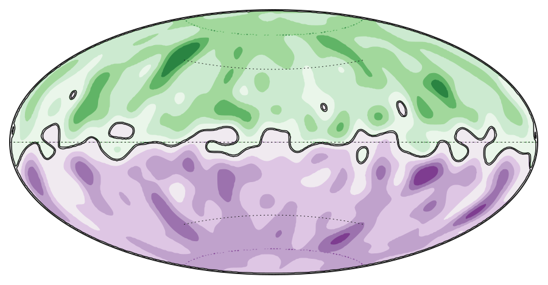

<p align="center">
  
</p>

# GeoDynamo.jl

[](https://github.com/subhk/GeoDynamo.jl/actions/workflows/ci.yml?query=branch%3Amain)
[](https://subhk.github.io/GeoDynamo.jl/stable/)
[](https://subhk.github.io/GeoDynamo.jl/dev/)
[](https://codecov.io/gh/subhk/GeoDynamo.jl)


GeoDynamo.jl is a Julia solver for rotating convection and self-sustained
planetary dynamos in spherical shells and full balls. It is built for the common
workflow in geodynamo studies: choose a spherical grid, set physical control
parameters and boundary conditions, initialize the velocity/thermal/magnetic
fields, then write NetCDF snapshots and restart files while the model advances.

Under the hood GeoDynamo.jl combines toroidal–poloidal vector fields,
SHTns-based spherical harmonic transforms, IMEX time stepping, MPI pencil
decomposition, and NetCDF output. The public API is intentionally compact, so a
small script can still describe a full reproducible run.

## Installation

```julia
using Pkg
Pkg.add(url = "https://github.com/subhk/GeoDynamo.jl")

# or for local development
Pkg.develop(path = "/path/to/GeoDynamo.jl")
Pkg.instantiate()
```

After installation load the package to trigger precompilation and parameter initialization:

```julia
julia> using GeoDynamo
```

## Quick Start

Configure and run a basic spherical shell dynamo simulation:

```julia
using GeoDynamo

# Build a grid, model, and simulation
grid = SphericalShellGrid(
    nr = 64,
    nr_inner = 16,
    lmax = 32,
    mmax = 32,
    nlat = 64,
    nlon = 128,
)

model = GeodynamoModel(
    grid;
    Ek = 1e-4,
    Pr = 1.0,
    Pm = 1.0,
    Sc = 1.0,
    Ra = 1e6,
    include_magnetic = true,
)

simulation = Simulation(model; Δt = 1e-5, stop_time = 0.1)
run!(simulation)
```

For MPI-parallel runs:

```bash
mpiexecjl -n 4 julia my_simulation.jl
```

## Complete Setup Example

This example shows the usual pieces in one place: boundary conditions, initial
conditions, field output, checkpoint output, and the run command.

Save it as `examples/my_shell_run.jl` or paste it into your own script:

```julia
using MPI
using GeoDynamo

MPI.Init()

# 1. Resolution and geometry
grid = SphericalShellGrid(
    nr = 64,
    nr_inner = 16,
    lmax = 31,
    mmax = 31,
    nlat = 64,
    nlon = 128,
)

# 2. Boundary conditions
velocity_bcs = BoundaryConditions(
    inner = NoSlip(),
    outer = StressFree(),
)

temperature_bcs = BoundaryConditions(
    inner = FixedTemperature(1.0),
    outer = FixedTemperature(0.0),
)

# 3. Model parameters
model = GeodynamoModel(
    grid;
    Ek = 1e-4,
    Ra = 1e6,
    Pr = 1.0,
    Pm = 1.0,
    velocity_bcs = velocity_bcs,
    temperature_bcs = temperature_bcs,
    include_magnetic = true,
)

# 4. Initial conditions
set!(model;
    temperature = AnalyticIC(:conductive),
    velocity = RandomPerturbation(amplitude = 1e-4, lmax = 8, seed = 1234),
    magnetic = AnalyticIC(:dipole; amplitude = 1.0),
)

# 5. Output writers
field_writer = FieldWriter(
    "output";
    schedule = TimeInterval(0.01),
    fields = [:velocity, :temperature, :magnetic],
)

checkpoint_writer = CheckpointWriter(
    "restart";
    schedule = TimeInterval(0.05),
)

# 6. Time integration
simulation = Simulation(
    model;
    Δt = 1e-5,
    stop_time = 0.1,
    output_writers = (
        fields = field_writer,
        checkpoints = checkpoint_writer,
    ),
)

run!(simulation)
```

Run the script with MPI so the NetCDF writer is active:

```bash
mpiexecjl -n 4 julia --project examples/my_shell_run.jl
```

The field writer creates history files under `output/`, and the checkpoint
writer creates restart files under `restart/`. To continue from a restart
directory:

```julia
simulation = Simulation(model; Δt = 1e-5, stop_time = 0.2, restart_from = "restart")
run!(simulation)
```

For compositional convection, enable the composition equation and add matching
boundary and initial conditions:

```julia
composition_bcs = BoundaryConditions(
    inner = FixedTemperature(1.0),
    outer = FixedTemperature(0.0),
)

model = GeodynamoModel(
    grid;
    include_composition = true,
    composition_bcs = composition_bcs,
)

set!(model; composition = AnalyticIC(:stratified; amplitude = 1.0))
```

## Boundary Conditions

Magnetic boundary conditions default to **insulating** and are applied automatically
when the magnetic field is enabled. A **conducting inner core** is available as an
opt-in for shell geometry:

```julia
model = GeodynamoModel(
    grid;
    include_magnetic = true,
    magnetic_inner_bc = :conducting_inner_core,  # default: :insulating
)
```

The inner core then evolves by magnetic diffusion and couples to the outer core at
the inner-core boundary (continuity of the field and its radial derivative). Current
scope: shell geometry, `CNAB2` timestepper, equal inner/outer conductivity.

See the [boundary conditions documentation](https://subhk.github.io/GeoDynamo.jl/stable/boundary-conditions/)
for the full set of velocity, temperature, composition, and magnetic options.

## GPU Backend

The rewritten solver path supports a first real GPU backend through SHTnsKit's
CUDA transform path. This is currently a hybrid backend:

- spherical harmonic analysis and synthesis run through the GPU path
- radial operators, implicit solves, and most solver state remain CPU-backed

To use it, load CUDA before creating the solver backend:

```julia
using GeoDynamo
using CUDA

grid = SphericalShellGrid(GPU(); nr = 64, lmax = 32)
model = GeodynamoModel(grid; include_magnetic = true)
simulation = Simulation(model; Δt = 1e-5, stop_time = 0.1)
```

If CUDA is not installed or no functional device is available, `architecture = :gpu`
fails with an explicit GPU-availability error instead of silently falling back.
